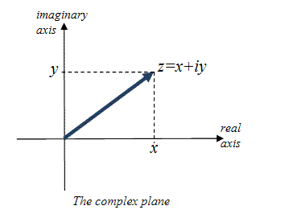

## Remark
(i) Let $z = (x, y) \in \mathbb{C}$ and assume $z \neq 0$.

The Euler's formula is given by

$$
e^{i\theta} = \cos \theta + i \sin \theta$$

## Definition
Let $z = (x, y) \in \mathbb{C}$. The ***exponential form*** of $z$ is defined by

$$z = r e^{i\theta}$$

where $r = \vert z \vert$ and $\theta = \arg(z)$.